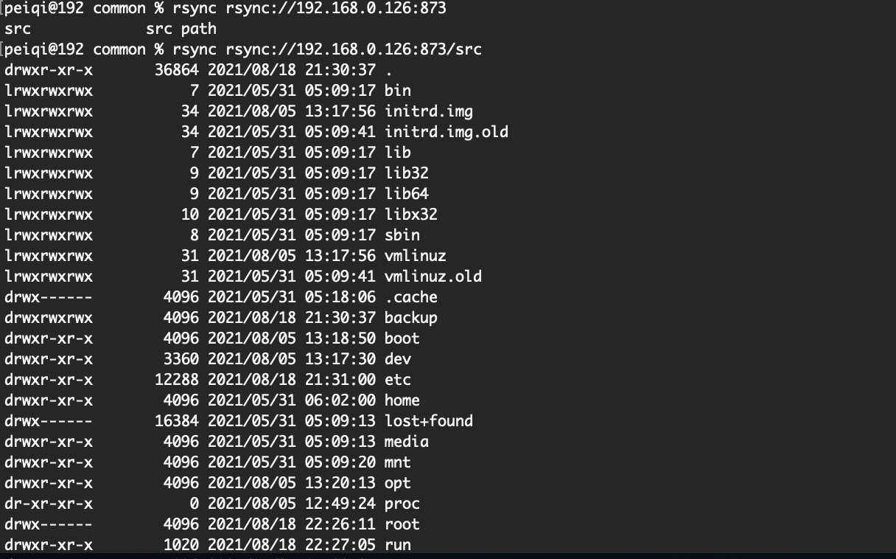
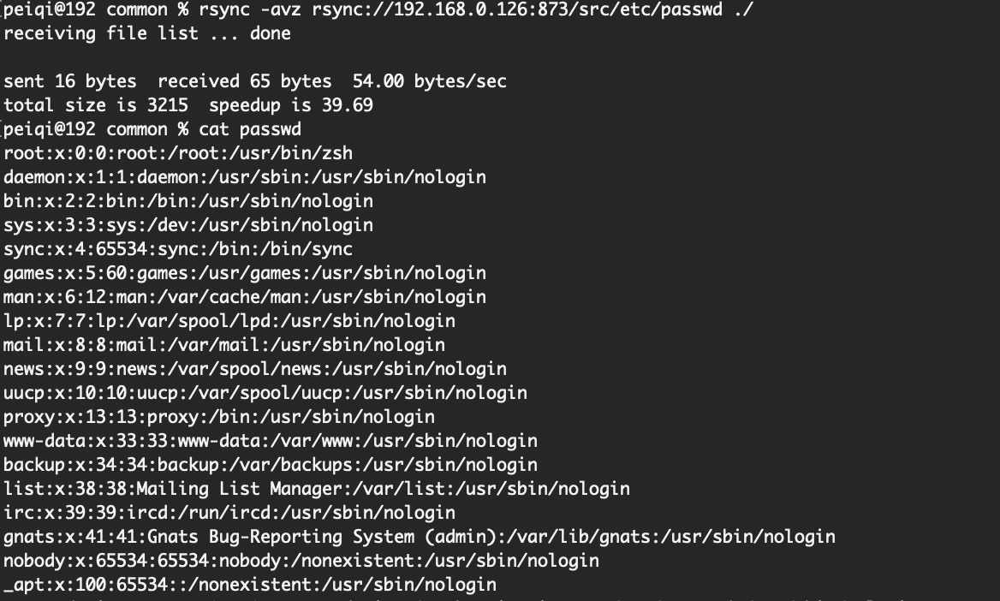
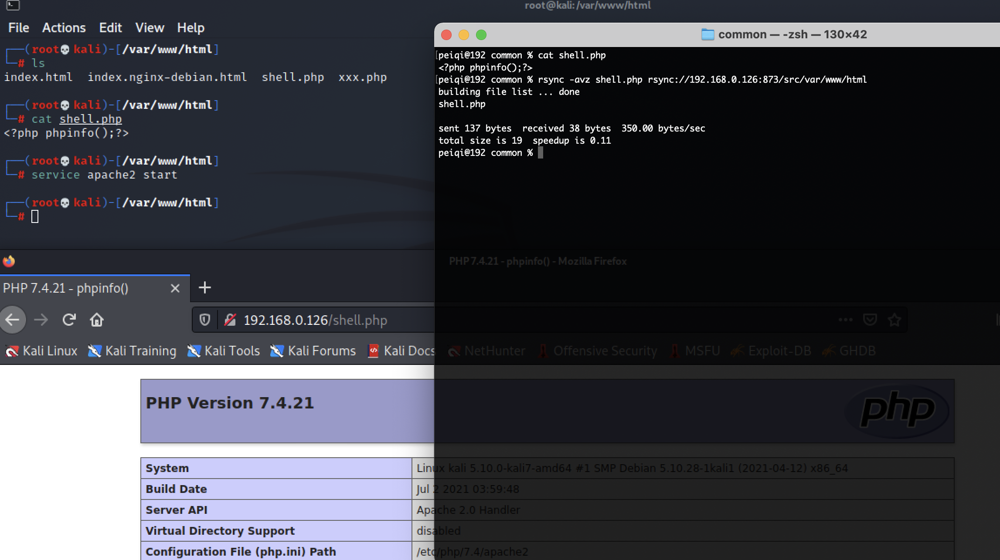

# Rsync 873端口

## 关于

<a-checkbox checked>Rsync为Linux下实现远程同步功能的软件，能同步更新两处计算机的文件及目录。</a-checkbox></br>

<a-checkbox checked>在同步文件时，可以保持源文件的权限、时间、软硬链接等附加信息。常被用于在内网进行源代码的分发及同步更新，因此使用人群多为开发人员；而开发人员安全意识薄弱、安全技能欠缺往往是导致rsync出现相关漏洞的根源。</a-checkbox></br>

<a-checkbox checked>rsync默认配置文件为/etc/rsyncd.conf，常驻模式启动命令rsync –daemon，启动成功后默认监听于TCP端口873，可通过rsync-daemon及ssh两种方式进行认证</a-checkbox></br>

## 攻击方法

与Rsync相关的几条命令

```bash
rsync ip::                        # 遍历可以同步的目录
rsync ip::backup                  # 遍历backup目录下可以同步的文件
rsync -avz ip::文件路径 本地路径     # 下载目录下文件
rsync -avz 本地文件路径 ip::目标路径  # 上传文件
```

## 连接目标



## 文件下载



## 文件上传

<a-alert type="success" message="在权限高，且已知Web路径的情况下，可上传Webshell文件获取权限" description="" showIcon>
</a-alert>
<br/>




在权限高，也可以写入定时文件反弹 Shell